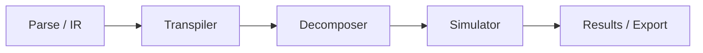

# Quantum Virtual Machine

Short one-paragraph overview of what the QVM is and why it exists.

## Quick Start

1. Installation steps or prerequisites.
2. Minimal example command or usage.

## Architecture Overview

Explain the pipeline and core modules:
- IR / Circuit model
- Transpiler
- Decomposer
- Simulator
- Export (OpenQASM)



## Core Concepts

### Circuits and Gates

Describe supported gates, parameters, and measurement semantics.

### Transpilation

Explain how logical circuits map to target hardware connectivity.

### Decomposition

Describe how multi-qubit gates are decomposed into native gates.

## Usage

```bash
# Example CLI / script usage
python -m qvm run examples/bell.qasm
```

## Examples

Provide short, focused examples with inputs and expected outputs.

## API Reference

List primary modules/classes/functions with brief descriptions.

## File Structure

Brief overview of the repo structure for the QVM.

## Notes and Limitations

List any constraints, performance notes, or known issues.

## Changelog

- 2026-02-22: Initial documentation scaffold.
