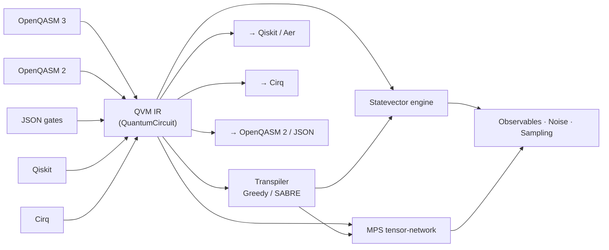

# Quantum Virtual Machine (QVM)

The Quantum Virtual Machine is a Python quantum computing toolkit built around a **"Write Once, Run Anywhere"** philosophy for quantum programs. It ingests circuits from five different sources — OpenQASM 3.0, OpenQASM 2.0, JSON gate lists, Qiskit, and Cirq — converts everything into one canonical Intermediate Representation (IR), transpiles onto hardware topologies, simulates exactly, and exports back to any other framework.

One pivot format means **N+M converters instead of N×M**, and one place to guarantee correctness.

```mermaid
flowchart LR
  Q3["OpenQASM 3"] --> IR
  Q2["OpenQASM 2"] --> IR
  J["JSON gates"] --> IR
  QK["Qiskit"] --> IR
  CQ["Cirq"] --> IR
  IR["QVM IR<br/>(QuantumCircuit)"] --> T["Transpiler<br/>Greedy / SABRE"]
  IR --> SV["Statevector engine"]
  IR --> MPS["MPS tensor-network"]
  T --> SV
  T --> MPS
  SV --> O["Observables · Noise · Sampling"]
  MPS --> O
  IR --> X1["→ Qiskit / Aer"]
  IR --> X2["→ Cirq"]
  IR --> X3["→ OpenQASM 2 / JSON"]
```

## Status

**v0.5.x — installable from PyPI, CI-verified on every push.**

| Aspect | State |
|---|---|
| Package | `pip install quantum-virtual-machine` (Python ≥ 3.10, MIT license) |
| Test suite | 210 tests: unit + triple-engine interop equivalence + stress corpus |
| Algorithm audit | 19-algorithm corpus (textbook → VQE/QAOA/portfolio) cross-checked against native simulators on every push |
| Release automation | Tagged releases build sdist/wheel, twine-check, publish to PyPI via GitHub Actions |
| Docs | Technical reference, guides, executable tutorials run by CI so they cannot rot |

## The pipeline

Every program takes the same path:

1. **Ingest** — a parser converts the source into `QuantumCircuit` IR. Malformed input fails eagerly at construction time (`QVMParseError`), never mid-simulation.
2. *(Optional)* **Bind parameters** — symbolic angles (`Parameter`, `ParameterExpression`) survive parsing and framework conversion; bind them later with a dict.
3. *(Optional)* **Transpile** — route logical qubits onto a target topology by inserting SWAPs (Greedy or SABRE heuristic).
4. **Simulate** — exact statevector evolution, or Matrix Product State evolution for low-entanglement circuits at 20+ qubits.
5. **Analyze** — measurement sampling, Pauli expectation values, Kraus-channel noise, device profiles.
6. **Export** — Qiskit, Cirq, OpenQASM 2.0, or lossless JSON round-trip.

## Gate vocabulary

All parsers and both interop bridges share this canonical set:

| Class | Gates |
|---|---|
| 1 qubit, no params | `h` `x` `y` `z` `s` `sdg` `t` `tdg` `sx` `sxdg` `id` |
| 1 qubit, 1 angle | `rx(θ)` `ry(θ)` `rz(θ)` `p(λ)` |
| 2 qubits, no params | `cx` `cz` `swap` |
| 2 qubits, 1 angle | `rxx(θ)` `rzz(θ)` `cp(λ)` |
| 3 qubits | `ccx` |
| Control flow | `measure`, `barrier`, `delay`, labels/jumps, classical ops |
| Multi-controlled | `mcx`, `mcz`, `mcp`, `mcry`, `mcrz`, `mcrx` — lowered *exactly* to basis gates |

Multi-controlled synthesis is exact (no approximations), which means Grover oracles written with native `mcx` import and simulate bit-for-bit correctly.

## Interoperability guarantees

Two promises govern every converter:

1. **No silent drops.** An operation either converts faithfully or raises `UnsupportedGateError` naming the offending gate. If a conversion returns, the result *is* your circuit.
2. **Physical equivalence.** Exported circuits reproduce QVM's measurement distributions — validated by a triple-engine suite comparing QVM vs Qiskit vs Cirq probabilities for every gate in the vocabulary.

Symbolic parameters survive the trip in both directions (Qiskit `Parameter` ↔ QVM `Parameter` ↔ Cirq sympy symbols).

## Performance

Pure-NumPy dense kernel vs compiled engines — best-of-3 wall clock, identical circuits ([full report](https://github.com/qayumXD/quantum-virtual-machine/blob/main/docs/reports/benchmark_2026-08-24.md)):

| Family | n | QVM statevector | QVM MPS | Qiskit Aer | Cirq |
|---|---|---|---|---|---|
| GHZ | 8 | 0.6 ms | 1.0 ms | 1.2 ms | 4.8 ms |
| GHZ | 16 | 14.5 ms | 1.7 ms | 40.1 ms | 8.8 ms |
| GHZ | 24 | 13.66 s | **1.6 ms** | 17.58 s | – |
| QFT | 12 | 10.0 ms | – | 21.4 ms | 18.5 ms |

The takeaway: for low-entanglement families (GHZ and friends), the MPS engine beats even Aer's compiled C kernel because it exploits structure that dense simulation cannot.

## Honest limitations

QVM documents its ceilings rather than hiding them:

- Dense statevector memory grows as O(2^N) — practical ceiling ≈ 16–20 qubits; use the MPS engine beyond that for low-entanglement work.
- The MPS engine targets near-nearest-neighbor circuits; long-range gates are handled by exact SWAP-routing but inflate bond dimension on highly entangled states.
- Noise simulation runs stochastic Kraus trajectories per shot — statistically exact, but shot-count scales runtime.
- No pulse-level control, no error correction, no GPU/stabilizer backends yet (roadmap).

## Explore deeper

- [Getting Started](/docs/qvm-getting-started) — installation, CLI, first simulation
- [Tutorial: Bell & Teleportation](/docs/qvm-tutorial-bell-teleportation)
- [Tutorial: Grover Search](/docs/qvm-tutorial-grover)
- [Tutorial: VQE](/docs/qvm-tutorial-vqe)
- [Simulation Engines](/docs/qvm-simulation-engines)
- [Framework Interop](/docs/qvm-interop)
- [Noise Modeling](/docs/qvm-noise)
- [Web API & Dashboard](/docs/qvm-web-api)

Source: [github.com/qayumXD/quantum-virtual-machine](https://github.com/qayumXD/quantum-virtual-machine)
