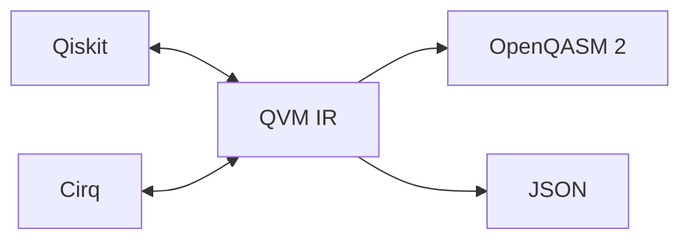

# Framework Interop: Qiskit & Cirq

QVM's IR is a *pivot*: every framework converts through it, so N frameworks need N converters instead of N×M pairwise bridges.



## The two guarantees

1. **No silent drops.** Every operation either converts faithfully or raises `UnsupportedGateError` naming the offending gate. *If a conversion returns, the returned circuit is your circuit.*
2. **Physical equivalence.** Exported circuits reproduce QVM's measurement probability distributions — enforced by a triple-engine test suite (QVM vs Qiskit Aer vs Cirq) that runs on every push.

## Converting

```python
import cirq, qiskit
from qvm.ir import QuantumCircuit

# Cirq → Qiskit via the pivot (two hops, one line)
circuit = cirq.Circuit(
    cirq.H(cirq.LineQubit(0)),
    cirq.CNOT(cirq.LineQubit(0), cirq.LineQubit(1)),
)
qk_circuit = QuantumCircuit.cirq_to_qiskit(circuit)

# Any direction through the IR
qc = QuantumCircuit.from_qiskit(qk_circuit)   # → IR
qk2 = qc.to_qiskit()                          # IR → Qiskit
cq  = qc.to_cirq()                            # IR → Cirq
qc3 = QuantumCircuit.from_cirq(cirq_circuit)  # Cirq → IR
```

You can also run foreign simulators straight off the converted object: `qc.run_qiskit_simulator(shots=1024)` and `qc.run_cirq_simulator(repetitions=1024)` return counts dicts — handy for cross-validation.

## Supported vocabulary

| Class | Gates |
|---|---|
| 1-qubit, no parameters | `h` `x` `y` `z` `s` `sdg` `t` `tdg` `sx` `sxdg` `id` |
| 1-qubit, 1 angle | `rx(θ)` `ry(θ)` `rz(θ)` `p(λ)` |
| 2-qubit, no parameters | `cx` `cz` `swap` |
| 2-qubit, 1 angle | `rxx(θ)` `rzz(θ)` `cp(λ)` |
| 3-qubit | `ccx` |
| Ancillary | `measure`, `barrier`, `delay` |

Behavior outside the table:

- **Multi-controlled gates** (`mcx`, `mcphase`, `mcry`, `mcrz`, `ccz`, …) are lowered **exactly** into basis gates during import — no approximations. Grover oracles built with native `mcx` just work.
- Anything else fails loudly with a message listing the supported set — or pass `transpile_foreign=True` to `from_qiskit` to auto-decompose through Qiskit's basis translator first.
- Global phase is not represented in the IR and is not preserved (physically unobservable; same convention as OpenQASM).

## Parameters survive conversion

Symbolic angles round-trip between ecosystems:

```python
from qiskit.circuit import Parameter as QKParam

theta = QKParam("theta")
qk = qiskit.QuantumCircuit(1)
qk.rx(theta, 0)

qc = QuantumCircuit.from_qiskit(qk)          # QVM ParameterExpression
bound = qc.bind_parameters({list(qc.parameters)[0]: 0.42})
```

- Qiskit `Parameter` ↔ QVM `Parameter` ↔ Cirq sympy symbols map by name.
- Linear expressions (`2*beta + 0.5`) import as QVM `ParameterExpression`.
- Fully-bound expressions export as floats; partially-bound ones raise `QVMConversionError` until you call `bind_parameters()`.

## Measurement keys

Cirq measurement keys normalize to the canonical `"register[index]"` format on import (legacy tuple-string keys still parse), aligning with QVM's classical-register model.

## When conversion raises

```python
from qvm.exceptions import UnsupportedGateError, MissingBackendError

try:
    QuantumCircuit.from_qiskit(exotic_circuit)
except UnsupportedGateError as e:
    print(e)   # names the gate + supported vocabulary
```

And if Qiskit/Cirq isn't installed at all, every interop entry point raises `MissingBackendError` — an `ImportError` subclass carrying the exact `pip install "quantum-virtual-machine[qiskit]"` command.
